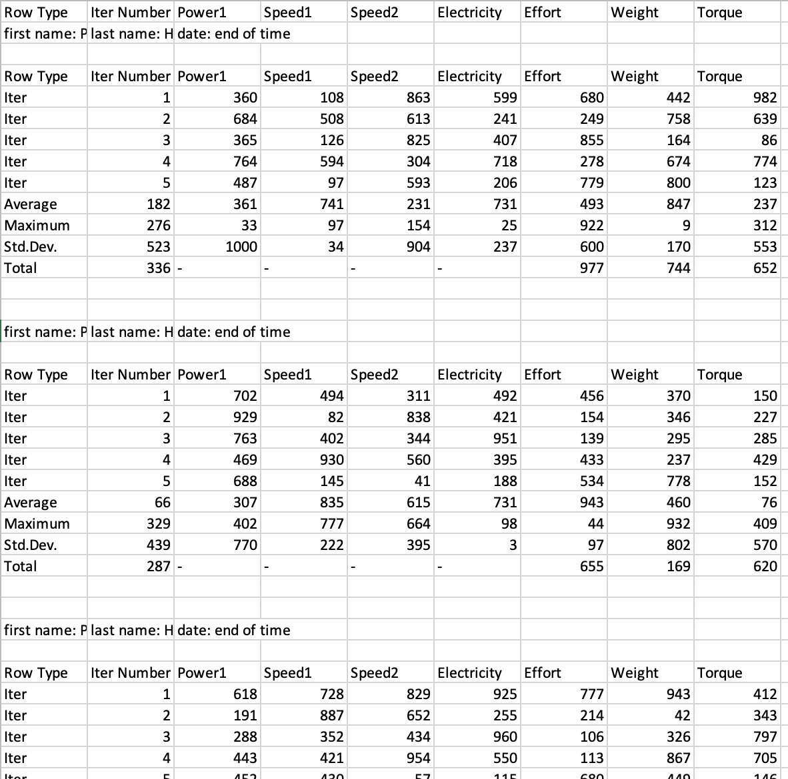
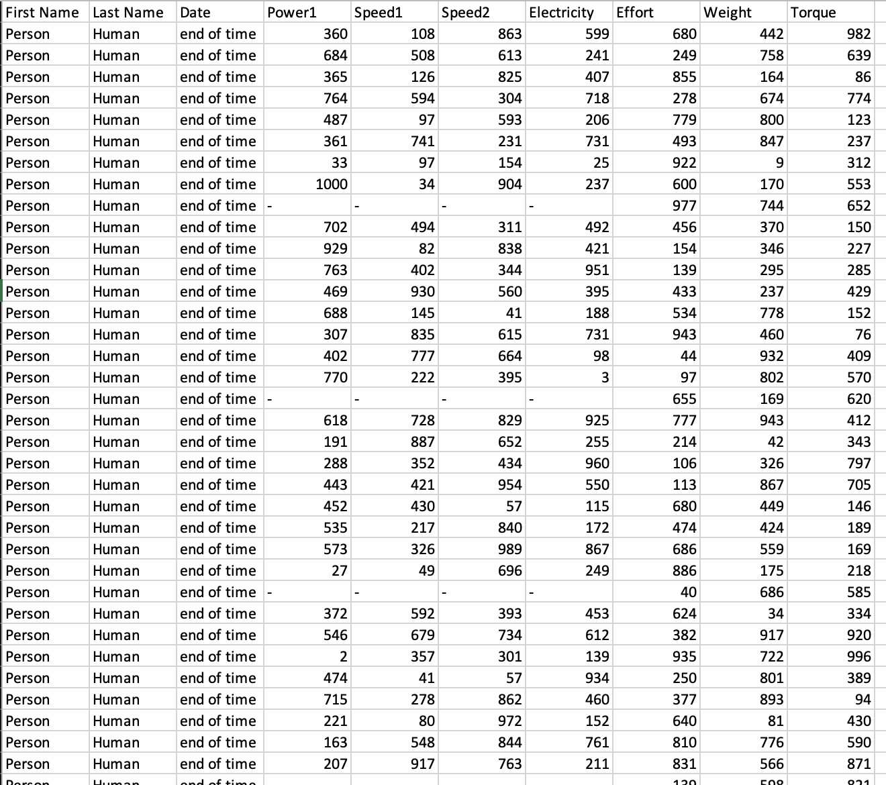

# DataCleaningChallenge
#### <u>Goal</u>: This challenge includes a datasource that is very unorganized, and messy. We must transform datasource into a nice-looking dataframe before further analysis can be performed. 
--- 

#### <i>pre-cleaning</i>:

#### <i>post-cleaning</i>:
